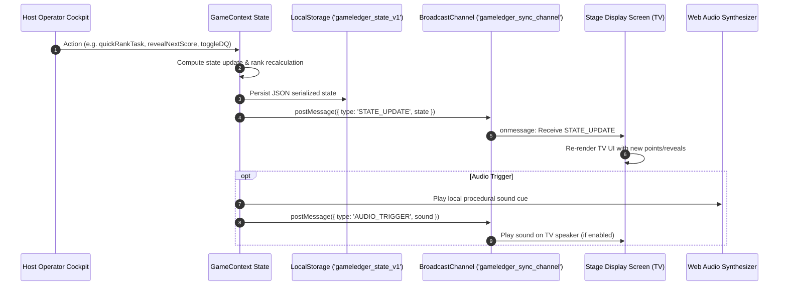
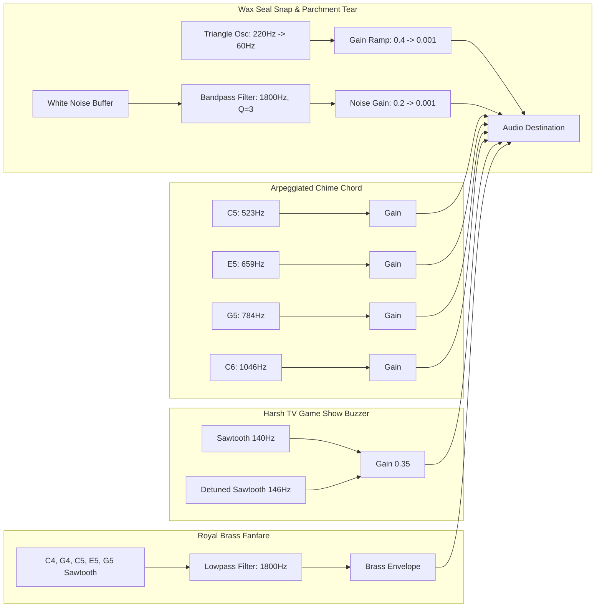

# GameLedger Technical Architecture

This document provides a deep-dive architectural specification of the **GameLedger** runtime engine, dual-screen synchronization pipeline, procedural audio synthesis, print subsystem, and component hierarchy.

---

## 🏗️ 1. Runtime Topology & Dual-Screen Model

GameLedger operates as a fully client-side single-page application (SPA) capable of running in two distinct screen modes without any backend servers:

```text
                               ┌──────────────────────────────────────────┐
                               │  Browser Window 1 (Operator Cockpit)     │
                               │  URL: http://localhost:5173/             │
                               │  Component: <HostDashboard />            │
                               └────────────────────┬─────────────────────┘
                                                    │
                               BroadcastChannel('gameledger_sync_channel')
                                                    │
                               ┌────────────────────▼─────────────────────┐
                               │  Browser Window 2 (Big Screen TV/Stage)  │
                               │  URL: http://localhost:5173/?stage=true  │
                               │  Component: <PresentationScreen />       │
                               └──────────────────────────────────────────┘
```

### Route & Mode Resolution

In [`src/App.tsx`](../src/App.tsx):
1. **Stage Display Mode (`?stage=true`)**:
   - Detected via `URLSearchParams(window.location.search).get('stage') === 'true'`.
   - Bypasses the host interface and directly mounts [`PresentationScreen`](../src/components/presentation/PresentationScreen.tsx).
   - Ideal for projecting to an external television, projector, or HDMI monitor via AirPlay / Chromecast / secondary monitor.
2. **Embedded Stage Mode**:
   - Host can click **"Stage Popout"** or **"Present Here"** to mount `<PresentationScreen onCloseEmbedded={...} />` directly inside the primary window for single-screen testing or presentation.
3. **Host Cockpit Mode (Default)**:
   - Renders [`HostDashboard`](../src/components/host/HostDashboard.tsx) containing the triage panels, live stage director bar, and task scoring controls.

---

## 🔄 2. State Synchronization & Communication Engine

The central state machine resides in [`src/context/GameContext.tsx`](../src/context/GameContext.tsx).

### Communication Protocol



### Broadcast Channel Message Types

Defined in [`src/types/index.ts`](../src/types/index.ts):

```typescript
export type BroadcastMessage =
  | { type: 'STATE_UPDATE'; state: GameLedgerState }
  | { type: 'AUDIO_TRIGGER'; sound: SoundType }
  | { type: 'CONFETTI_BURST' }
  | { type: 'STAGE_PING' }
  | { type: 'STAGE_PONG' };
```

### State Mutations & Concurrency Invariants
- **Atomic Functional State Updates**: State transitions use `setState((prev) => ...)` to eliminate race conditions between rapid operator score inputs and active stopwatch/countdown ticks.
- **State Defaults Hydration**: Whenever state is loaded from `localStorage` or received via `BroadcastChannel`, it passes through `ensureStateDefaults(state)` to ensure newly added properties (e.g. `teams`, `revealedBetContestantIds`, `showPartLabel`) are never `undefined`.

---

## 🔊 3. Procedural Audio Synthesis Architecture

GameLedger enforces a strict **zero external audio files** policy. All sound effects are generated dynamically via the **Web Audio API** in [`src/utils/audio.ts`](../src/utils/audio.ts).

### Synthesizer Circuit Topologies



### Sound Cue Reference

| Sound Cue | Audio Type | Waveform / Synthesizer Circuit | Typical Trigger Context |
| :--- | :--- | :--- | :--- |
| `seal` | Percussive pop + noise | Triangle slide (220Hz $\to$ 60Hz) + Bandpassed white noise burst | Opening task envelope; switching to task brief view. |
| `tick` | Short ping | 800Hz sine burst (40ms decay) | Last 5 seconds of countdown clock. |
| `buzzer` | Dissonant drone | Dual detuned sawtooths (140Hz + 146Hz) | Timer expiring at 00:00; lost bet. |
| `reveal` | Ascending arpeggio | Staggered 4-note chord (C5, E5, G5, C6) | Score revealed on stage; points updated; bet won. |
| `dq` | Sad trombone slide | Sawtooth linear ramp down (180Hz $\to$ 80Hz) | Disqualification button clicked. |
| `fanfare` | Regal brass fanfare | 5-note melodic brass sequence with 1800Hz lowpass filter | Episode winner; Series champion coronation. |

---

## 🗂️ 4. Component Hierarchy & File Map

```text
src/
├── components/
│   ├── host/                           # Operator Cockpit Components
│   │   ├── HostDashboard.tsx           # Primary workspace layout & modal orchestration
│   │   ├── HostHeader.tsx              # Brand banner, episode switcher, import/export buttons
│   │   ├── StageDirectorBar.tsx        # Sticky live switcher controlling TV stage views & reveals
│   │   ├── TaskListSidebar.tsx         # Episode task listing, re-ordering, active task selector
│   │   ├── TaskScorerPanel.tsx         # Central cockpit: 5-4-3-2-1 buttons, DQs, times, bets, subtasks
│   │   ├── HostSummaryDrawer.tsx       # Collapsible sidebar with real-time episode/series standings
│   │   ├── ContestantManagerModal.tsx  # Add/edit/remove contestants and multi-team assignments
│   │   ├── NewTaskModal.tsx            # Create standard, team, studio, or multi-part subtasks
│   │   ├── PrintTasksModal.tsx         # Configurator modal for printing task sheets & envelopes
│   │   └── PrintTasksContainer.tsx     # Specialized print-only DOM container for @media print
│   └── presentation/                   # Big Screen Stage Components
│       ├── PresentationScreen.tsx      # Stage frame, lighting effects, blackout, keyboard shortcuts
│       └── views/
│           ├── IdleStageView.tsx       # Golden wax seal logo display for pre-show / intermissions
│           ├── TaskBriefView.tsx       # Parchment wax-sealed letter reveal with live stage clock
│           ├── AttemptsView.tsx        # Contestant submissions, notes, and recorded times showcase
│           ├── ScoreRevealView.tsx     # Theatrical wax seals concealing points; step-by-step reveal
│           ├── LeaderboardView.tsx     # Animated score bar race (Episode & Series standings, Team totals)
│           └── WinnerCeremonyView.tsx  # 3-tier podium ceremony, trophy spotlight, and confetti burst
├── context/
│   └── GameContext.tsx                 # Central state provider, BroadcastChannel sync, audio router
├── data/
│   └── demoData.ts                     # Pre-packaged Series 1 demo state & clean empty state
├── types/
│   └── index.ts                        # TypeScript interfaces, types, and message payloads
├── utils/
│   ├── audio.ts                        # Native Web Audio API procedural synthesizer
│   └── printTasks.ts                   # Page pagination, font sizing, and prompt formatting for print
├── App.tsx                             # URL query router (?stage=true vs Host dashboard)
├── index.css                           # Tailwind 4 theme, parchment styling, wax seal effects
└── main.tsx                            # Vite React 19 entry point
```

---

## 🖨️ 5. Printable Physical Tasks Subsystem

GameLedger supports generating physical Taskmaster letters designed for folding into envelopes with real wax seals.

```text
┌────────────────────────────────────────────────────────┐
│ Screen Interactive DOM (CSS class: .screen-only)       │
│ Displayed on laptop/monitor; hidden during @media print│
└────────────────────────────────────────────────────────┘
┌────────────────────────────────────────────────────────┐
│ Print Rendered DOM (CSS class: .print-only)            │
│ Visible ONLY during window.print(); hidden on screen   │
│ Formatted with page-break-after: always                │
└────────────────────────────────────────────────────────┘
```

### Architecture of Print Generation
1. **Model Generation ([`src/utils/printTasks.ts`](../src/utils/printTasks.ts))**:
   - `getTasksForScope(scope, episode, episodes, activeTaskId)` filters tasks according to scope (`'current_task'`, `'episode'`, or `'series'`).
   - `generatePrintablePages(tasks, options)` parses tasks and subtasks into an array of `PrintablePageItem` structures.
2. **Text Normalization**:
   - Detects whether task brief ends with `"Your time starts now."` to avoid redundant duplication.
   - Converts numeric duration (e.g. `150` seconds) to natural prose (e.g. `"You have 2 minutes and 30 seconds."`).
3. **Print DOM Component ([`src/components/host/PrintTasksContainer.tsx`](../src/components/host/PrintTasksContainer.tsx))**:
   - Renders pure typewriter text on letter-spaced clean pages with standard margins and per-task font sizing overrides (`fontSizePt`).
   - Styled via `@media print` rules in [`src/index.css`](../src/index.css).
