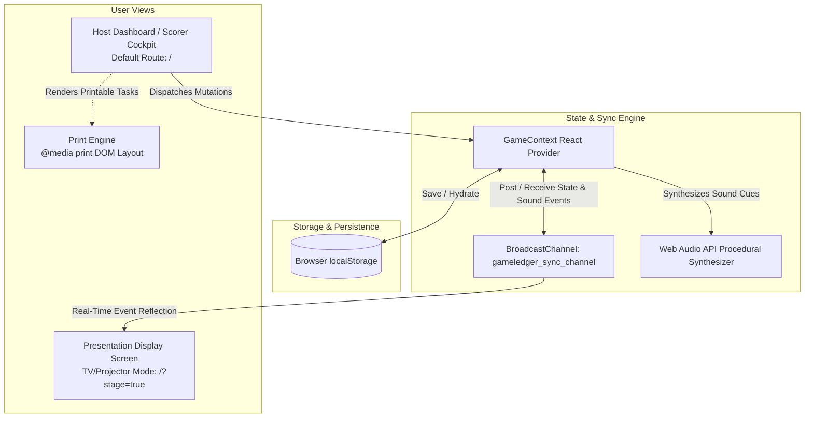

# GameLedger Documentation Index

Welcome to the **GameLedger** technical documentation. This directory provides authoritative specifications, architectural guides, and engineering playbooks designed specifically for both human contributors and **autonomous AI coding agents**.

---

## 📚 Documentation Suite

| Document | Purpose | Key Target Audience |
| :--- | :--- | :--- |
| [**`ARCHITECTURE.md`**](./ARCHITECTURE.md) | Technical architecture, dual-screen synchronization engine, procedural audio synthesis, print subsystem, and runtime topology. | Systems architects, AI agents modifying state/sync. |
| [**`SPECIFICATIONS.md`**](./SPECIFICATIONS.md) | Exhaustive behavioral specifications for every feature: scoring rules, tie ranking, DQs, multi-team mode, subtasks, spectator betting, and presentation stage state machines. | Feature developers, QA testers, prompt engineers. |
| [**`AGENTIC_ENGINEERING.md`**](./AGENTIC_ENGINEERING.md) | Operational guidelines, implementation recipes, verification checklists, and anti-patterns for autonomous AI agents. | AI coding agents, pair programmers, workflow automators. |
| [**`SCHEMA.md`**](./SCHEMA.md) | Authoritative reference for the JSON import/export schema, entity definitions, and validation rules. | Integration engineers, database/schema maintainers. |
| [**`gameledger.schema.json`**](./gameledger.schema.json) | Formal Draft 2020-12 JSON Schema for validating game state exports. | Automated validators, CI/CD pipelines. |

---

## 🧭 System Overview at a Glance

**GameLedger** is a standalone, offline-ready web application built for hosting, scoring, and theatrically presenting Taskmaster-style game nights, team competitions, and multi-episode series.



### Core Stack & Technology Invariants

- **Runtime & UI**: React 19 + TypeScript 7 + Vite 8
- **Styling**: Tailwind CSS 4 (`@tailwindcss/vite`) + Authentic Taskmaster Victorian aesthetic (crimson velvet, gold filigree, wax seals, aged parchment)
- **State & Dual-Screen Sync**: React Context + Browser `BroadcastChannel` (cross-window/cross-screen without any backend or WebSocket server) + `localStorage` fallback
- **Audio**: 100% offline, zero-asset Web Audio API programmatic sound synthesizer (`playSealBreak`, `playCountdownTick`, `playBuzzer`, `playScoreReveal`, `playDQSound`, `playFanfare`)
- **Graphics & Assets**: Pure SVG emblem (`public/wax-seal.svg`), CSS-driven wax seals, and `canvas-confetti`
- **Build & Paths**: Strict relative base path (`base: './'`) for seamless operation on GitHub Pages and local filesystem viewers

---

## ⚡ Essential Commands

```bash
# Install dependencies
npm install

# Start local development server (port 5173)
npm run dev

# Run full test suite (scoring, print, schema, and architectural invariants)
npm test

# Run individual test suites
npm run test:scoring      # Scoring logic, ties, DQs, subtasks, rank calculations
npm run test:print        # Printable task generation and formatting
npm run test:invariants   # Architectural invariants, zero-asset audio, and schema validation

# Run TypeScript typecheck (strict noEmit)
npm run typecheck

# Typecheck and build production bundle
npm run build
```

---

## 🤖 Guide for Autonomous AI Agents

When interacting with this repository, agents should adhere to the following reading path based on the task:

1. **Modifying state, actions, or multi-screen communication?**  
   Read [`ARCHITECTURE.md`](./ARCHITECTURE.md) and [`src/context/GameContext.tsx`](../src/context/GameContext.tsx).
2. **Modifying scoring rules, ranking, DQs, subtasks, or betting?**  
   Read [`SPECIFICATIONS.md`](./SPECIFICATIONS.md) and verify changes against [`tests/scoring.test.mjs`](../tests/scoring.test.mjs).
3. **Adding a new feature or stage view?**  
   Read [`AGENTIC_ENGINEERING.md`](./AGENTIC_ENGINEERING.md) for step-by-step implementation recipes and definitions of done.
4. **Updating data structures or persistence fields?**  
   Read [`SCHEMA.md`](./SCHEMA.md) and update [`src/types/index.ts`](../src/types/index.ts) alongside [`gameledger.schema.json`](./gameledger.schema.json).
