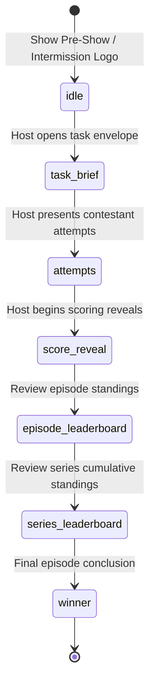

# GameLedger Feature Specifications & Rules Engine

This document provides exhaustive, deterministic specifications for all core features, scoring algorithms, tie-breaking mechanics, stage presentation workflows, and system invariants in **GameLedger**.

---

## 🎯 1. Domain Entities & Hierarchy

```text
GameLedgerState
├── contestants: Contestant[]          (Global roster: 2+ contestants)
├── teams: Team[]                      (Optional multi-team roster: 2+ teams)
├── episodes: Episode[]                (Series episodes: 1+ episodes)
│   └── tasks: Task[]                  (Tasks per episode: 1+ tasks)
│       ├── assignedContestantIds[]    (Subset of active participants; omitted = all)
│       ├── subtasks: SubTask[]        (Optional multi-part steps: Part 1, Part 2...)
│       ├── bets: Record<cid, TaskBet> (Spectator bets placed by sat-out contestants)
│       └── scores: Record<cid, Score> (Scores for active contestants)
├── presentation: PresentationConfig   (Live state of TV presentation display)
└── timer: TimerState                  (Stopwatch or countdown timer state)
```

---

## ⚖️ 2. Scoring Engine & Ranking Algorithm

### Standard Point Scale
Tasks traditionally award points on a 5-to-1 scale based on contestant rank:
- **1st Place**: 5 points
- **2nd Place**: 4 points
- **3rd Place**: 3 points
- **4th Place**: 2 points
- **5th Place**: 1 point

*Note: The Taskmaster has full discretion to award custom values (e.g. 0 points, bonus points, negative penalties, or values $>5$).*

### Competition Tie Ranking (1-2-2-4)

When multiple contestants achieve the same score or time, GameLedger applies **standard competition ranking** (also known as "1224" ranking):

$$\text{Rank}(i) = 1 + \sum_{j \neq i} \mathbf{1}_{(\text{Points}_j > \text{Points}_i)}$$

#### Example:
| Contestant | Raw Points | Computed Rank | Awarded Points (if auto-ranked) |
| :--- | :---: | :---: | :---: |
| Alice | 18 | 1 | 5 |
| Bob | 14 | 2 (Tie) | 4 |
| Charlie | 14 | 2 (Tie) | 4 |
| Diana | 11 | 4 | 2 |
| Eddie | 8 | 5 | 1 |

*Notice that Diana is ranked 4th (skipping rank 3) because two contestants tied for 2nd.*

### Time-Based Auto-Scoring
When **"Auto-Score by Time"** is clicked for timed tasks:
1. Contestants with recorded `timeTakenSeconds` who are **not disqualified** are sorted in ascending order (fastest time first).
2. The fastest contestant receives Rank 1 (5 points), 2nd fastest receives Rank 2 (4 points), continuing down to 1 point.
3. Contestants without recorded times or disqualified contestants receive 0 points.

### Atomic Batch Score Commits
To prevent partial state updates when host operators adjust scores:
- Score changes can be entered as local drafts (`draftPoints`, `draftNotes`, `draftTimes`).
- Clicking **"Update Task Scores"** or pressing Enter commits the entire active contestant matrix in a single atomic dispatch to `GameContext`, recalculating all contestant ranks and broadcasting the update to the stage display in one render cycle.

---

## 🚫 3. Disqualification (DQ) Protocol

Disqualification is a central comedic mechanic in Taskmaster. GameLedger enforces the following invariants whenever a contestant is disqualified:

1. **Points Set to 0**: A disqualified contestant's score is immediately forced to `0` points. They cannot earn placement points.
2. **Audio Cue**: Trigger procedural sad trombone slide (`playDQSound`).
3. **Visual DQ Stamp**:
   - Operator cockpit highlights the contestant row in crimson with an active `"DQ'D"` badge.
   - Stage Display renders a bold red dashed border with a tilted `"DISQUALIFIED"` stamp over the contestant's score card.
4. **Custom DQ Reason**: Host can record custom reasons (e.g., *"Stepped outside the red circle"*, *"Touched the green egg"*), which are revealed on stage beneath the DQ stamp.
5. **Reversible**: Toggling DQ off restores the contestant's eligibility and assigns a default 1 point.

---

## 🧩 4. Multi-Part Tasks (Subtasks)

Complex tasks frequently involve multiple stages or parts (e.g., *"Part 1: Retrieve the duck. Part 2: Decorate the duck."*).

### Stage View Secrecy Invariant
> [!IMPORTANT]
> **Stage Brief View Never Reveals the Master Task Title!**  
> On the TV Stage Brief screen ([`TaskBriefView`](../src/components/presentation/views/TaskBriefView.tsx)):
> 1. The master task title (e.g., *"The Secret Heist"*) is **strictly hidden** so contestants in the studio cannot guess the upcoming surprise.
> 2. Multipart tasks default to displaying **Part 1's brief** immediately.
> 3. If **"TV Label"** is toggled ON, the TV displays an unrevealing badge: `"Part 1"`, `"Part 2"`, etc. Subtask names (e.g., *"Crack the safe"*) are hidden from contestants until the host chooses to reveal them.

### Subtask Rollup Modes

GameLedger supports two automated rollup modes to combine subtask scores into the master episode task:

| Rollup Mode | Mode Key | Behavior | Formula / Algorithm |
| :--- | :--- | :--- | :--- |
| **Sum of Parts** | `'sum'` | Contestant's master task score is the direct sum of points earned across all subtasks. Attempt notes are concatenated (`"Part 1: Note \| Part 2: Note"`). | $\text{Points}_{\text{Master}} = \sum_{k} \text{Points}_{\text{Subtask}_k}$ |
| **Final Rank** | `'final_rank'` | Subtask points are summed as raw criteria scores, and then converted onto the standard Taskmaster 5-to-1 scale based on relative performance. | $\text{Points}_{\text{Master}} = \text{Scale}[\text{Rank}(\sum_k \text{Points}_{\text{Subtask}_k})]$ |
| **Custom / Manual** | `'custom'` | Subtask scores are recorded independently for reference; master task scores are entered manually by the host. | N/A |

*Subtask DQ Invariant*: If a contestant is disqualified in any subtask under `'sum'` or `'final_rank'`, their master task score is flagged as disqualified with 0 points.

---

## 🛡️ 5. Multi-Team Support (>2 Teams)

GameLedger natively supports arbitrary team counts (2, 3, 4, or more teams):

- **Default Teams**: Team A (Crimson), Team B (Blue), Team C (Gold). Additional custom teams can be added via [`ContestantManagerModal`](../src/components/host/ContestantManagerModal.tsx).
- **Contestant Team Assignment**: Each contestant has an optional `teamId`. Contestant identity badges display their team color and avatar across all views.
- **Team Challenges (`Task.type === 'team'`)**:
  - The Task Scorer Panel displays quick-award buttons for each team (e.g. `[5 pts]`, `[4 pts]`, `[3 pts]`).
  - Clicking a team point button atomically assigns those points to all active members of that team without overwriting members of other teams.
- **Team Standings View**:
  - The Stage Leaderboard has a **"Teams"** toggle that aggregates individual contestant scores by team, displaying team badges, member rosters, and cumulative team scores.

---

## 🎲 6. Participant Sit-Out & Spectator Betting

In team episodes or uneven contestant tasks, some contestants must sit out (e.g., 3 vs 2 team games, or studio tasks limited to 2 contestants).

### Sit-Out Invariants
1. **Exclusion from Task Scoring**: Contestants toggled as **"Sat Out"** are excluded from active rank calculations and score reveal sequences.
2. **Task Count Preservation**: Sat-out tasks **do not increment** the contestant's completed task count in episode/series standings (`entry.isSatOut === true`).
3. **Reset Control**: Host can click *"Reset: All Active"* to restore all contestants to active participation.

### Spectator Betting Mechanics
Sat-out contestants can act as spectators and place predictions/wagers on active contestants or teams:

1. **Bet Configuration**:
   - `bettorId`: The sat-out contestant placing the bet.
   - `targetContestantId` or `targetTeamId`: The contestant or team predicted to win.
   - `rewardPoints`: Points awarded if prediction is correct (default: `2` points).
   - `notes`: Playful banter or prediction justification.
2. **Auto-Resolution (`resolveTaskBets`)**:
   - Evaluates active contestants to determine the 1st place winner(s) (highest points, not DQ'd).
   - If the bet matches a 1st place winner, `bet.isWon = true` and `rewardPoints` are automatically credited to the bettor as `bonusPoints`.
   - If incorrect, `bet.isWon = false` with 0 points.
   - Bettor retains `isSatOut: true` status so their task count is not incremented.
3. **Stage Bet Reveals**:
   - Host can click **"Bets"** in the Stage Director bar or on stage cards to reveal spectator wagers with audio cues.

---

## 📺 7. Stage Presentation State Machine

The stage presentation display (`PresentationScreen`) acts as a theatrical state machine controlled remotely by the host:



### Presentation Views Reference

| View Key | Title | Description & Visual Features |
| :--- | :--- | :--- |
| `idle` | Holding Logo | Theatrical spotlight on rotating golden Taskmaster wax seal. |
| `task_brief` | Task Brief | Aged parchment envelope with wax seal, typewriter brief, and live stage countdown timer. Hides master task title. |
| `attempts` | Attempts Showcase | Contestant avatar grid with recorded attempt quotes, times, and submission descriptions. Spotlight highlight available. |
| `score_reveal` | Score Reveal | Contestant cards with points hidden behind golden wax seals. Spacebar reveals scores one-by-one from lowest to highest. Bold red stamp for DQs. |
| `episode_leaderboard` | Episode Standings | Animated racing score bars displaying current episode totals. Solo / Team view toggle. Gold trophy for 1st place. |
| `series_leaderboard` | Series Standings | Animated cumulative series leaderboards across all completed episodes. |
| `winner` | Crown Champion | 3-tier coronation podium (2nd, 1st, 3rd) with golden head trophy, regal fanfare audio, and continuous confetti bursts. |

### Presentation Keyboard Shortcuts

| Shortcut | Action | Description |
| :---: | :--- | :--- |
| <kbd>Space</kbd> | Next Score Reveal | Reveals the next lowest score in `score_reveal` mode with audio cue. |
| <kbd>F</kbd> | Toggle Fullscreen | Enters or exits native browser fullscreen display. |
| <kbd>B</kbd> | Dramatic Blackout | Toggles complete black screen overlay for theatrical suspense. |
| <kbd>Esc</kbd> | Exit Embedded View | Exits embedded presentation mode on the host laptop. |

---

## 📋 8. Non-Negotiable System Invariants

| Invariant | Rule | Enforcement Mechanism |
| :--- | :--- | :--- |
| **Offline Execution** | Zero network calls or CDN audio dependencies. | Procedural Web Audio API in [`audio.ts`](../src/utils/audio.ts); local SVG assets. |
| **Base Path** | Must work on localhost and subpaths (`https://user.github.io/repo/`). | `base: './'` in `vite.config.ts`; relative asset URLs. |
| **DQ Points** | Disqualified contestants must always receive 0 points. | Enforced in `GameContext` scoring methods and verified in test suite. |
| **Secrecy in Briefs** | Master task titles must never be rendered on the TV Task Brief. | Verified in [`tests/scoring.test.mjs`](../tests/scoring.test.mjs). |
| **Tie Ranking** | Ties must follow standard competition ranking (1-2-2-4). | Handled in rank calculation loops and tested in test suite. |
| **Sit-Out Exclusion** | Sat-out contestants must not have their completed task count incremented. | Filtered by `!entry.isSatOut` in `calculateTotals()`. |
| **TypeScript Strict** | No unused variables, unused imports, or `any` type escapes. | Enforced by `npm run build` (`tsc -b`). |
